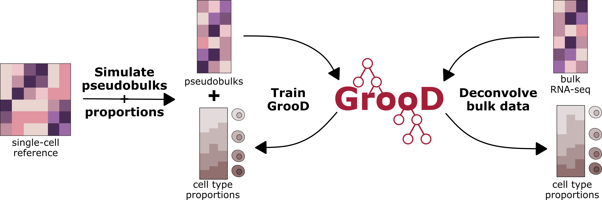

# GrooD - GradientBoostedDeconvolution



## Principle

**Gr**adientB**oo**sted**D**econvolution (GrooD) employs gradient boosted trees for bulk transcriptome deconvolution. The working principle comprises three main steps:
1. Pseudobulk-based model training; heterogeneity is a key feature
2. Model evaluation and interpretation after training
3. Inference of bulk cell type proportions with trained model

For **step 1**, the user either provides own pseudobulks with associated cell type proportions as target values or inputs scRNA-seq (snRNA-seq data also suited), from which pseudobulks are simulated in the tool. After a train-test split, the GrooD model is trained on the pseudobulks to predict the corresponding cell type proportions, where each gradient boosting model infers the proportions for one cell type specifically (except for MultiGrooD mode, see below). Thereby, the model learns the features that are most predictive of cell type proportions in a bulk-like context.

In **step 2**, the model is evaluated on the test split using both correlation and error metrics per cell type and across all predicitions. Also, the feature importances are plotted to inform about marker genes learned for each cell type from the pseudobulk-based training. This can help to evaluate model predictions and increase prediction interpretability.

Finally (**step 3**), provided bulk RNA-seq data, the model infers the cell type proportions for the set of cell types given the genes it has been trained on. The tool will immediately visualize cell type proportion distribution per and across samples. Also, when ground-truth cell type proportions are provided these will be used to calculate and visualize correlation and error metrics for the predictions.

In contrast to most other regression models, which extract marker genes from single-cell data for each cell type prior to deconvolution, GrooD may learn combinations of features that are predictive of cell type proportions. The boosting - using a multitude of trees - refines the prediction results gradually during training naturally identifying the most important genes (features) for each cell type in the bulk-like context immediately. As the model can infer proportions that in sum exceed 100 % an additional constraint is placed correcting predicitons to a total sum of 100 %, if exceeding this sum. Thereby, the model allows to predict unknown content, if predictions range below 100 %.


## GrooD implementations

In the current tool, users can choose from three GrooD implementations, each with its specific advantages. Multi-threading is recommended for use across implementations, but especially recommended for **GrooD**. Notably, only GrooD has been extensively tested so far, while **XGrooD** and **MultiGrooD** are still experimental.

### GrooD

The standard implementation of **GrooD** uses the ```scikit-learn``` implementation of ```GradientBoostingRegressor``` wrapped in a ```MultiOutputRegressor```, where each Regressor predicts the proportions of a single cell type. The model is comparably slow but convinces by rather accurate predictions. Optimal parameters are given by default.
This implementation can be used setting ```--grood_mode grood```.

### XGrooD

**XGrooD** is designed and functionally very similar to GrooD but makes use of the ```XGBoost``` implementation of ```XGBRegressor``` wrapped in a ```MultiOutputRegressor```, where each Regressor predicts the proportions of a single cell type. Due to hist boosting this model is comparably fast.
This implementation can be used setting ```--grood_mode xgrood```.

### MultiGrooD

Different to GrooD and XGrooD, **MultiGrooD** employs a custom gradient boosting model from ```XGBoost``` that uses a multi target prediction strategy. Basically, each leave of a single tree predicts the proportion of a single cell type. Thereby, the booster learns the predictions of cell type proportions in relation to each other and is further constraint to a maximum prediction of 1 across cell types per sample.
This implementation can be used setting ```--grood_mode multigrood```.


## Usage modes

### Train_test

In **train_test** mode, a model will only be trained, evaluated and tested on the pseudobulk data. The trained model will be saved for re-usage in inference mode. Make use of gene filtering and normalization options, which will be saved in the model and loaded upon model import.

### Inference

In **inference** mode, a trained model will be loaded and used to infer cell type proportions from the bulk transcriptome data following visualization and optional evaluation.

### All

The **all** mode combines train_test and inference mode. An additional useful feature is that pseudobulk and bulk can be subset with the intersect flags via ```--feature_curation```, thereby reducing the set to all intersecting genes (all_intersect), mRNA intersecting genes (mRNA_intersect) or intersecting non-zero-variance genes (non_zero_intersect), which can significantly boost performance of bulk transcriptome deconvolution.


## Pseudobulk simulation strategies

The pseudobulk simulation strategy is adapted from **TAPE** (https://github.com/poseidonchan/TAPE; Chen, Nat Commun, 2022). Multi-threading is available to speed-up pseudobulk simulation. Random proportions are generated (if not supplied) and the single-cell data used to sample single-cells based on ```cell_type``` column in obs of AnnData object to aggregate their expression profiles. Resulting pseudobulks can be normalized by counts-per-million (CPM), rank or log(p+1). Three different options are available for simulation

- canoncial simulation (```no_target```): only accounts for cell type identity during cell sampling
- condition-specific simulation (```condition```): accounts for (a specified or) condition factor such as batch origin or disease state during simulation and only samples cells from the same conditions to simulate a single pseudobulk
- individual-specific simulation (```individual```): accounts for origin of cells from distinct individuals and only simulates pseudobulks with cells from dstinct individuals

## Installation

Install with files from the ```env```directory. We provide a starting point for mamba/conda as well as pip environments.

Mamba environment (conda analog)
```bash
mamba create -f GrooD.yml
mamba activate GrooD
```

Pip environment
```bash
python -m venv GrooD
source GrooD/bin/activate
pip install --upgrade pip
pip install -r requirements.txt
```

## Input

### Data

``--bulk``              input bulk data path: either pseudobulk or bulk data for inference or all mode. Bulk can be in csv, tsv or h5ad format. In h5ad format, default
                    layer X needs to contain the desired data.

``--props``             cell type proportions for evaluation of deconvolution of pseudobulk/bulk data in inference or all mode. OPTIONAL. Supply in csv or tsv format.

``--sc``                input scRNA-seq data path, data in h5ad format for pseudobulk simulation

### Pseudobulk simulation

``--no_pseudobulks``    Number of pseudobulks to simulate.

``--no_cells ``         Number of cells to sample per pseudobulk.

``--target ``           Specifiy condition or individual as additional layer for specific pseudobulk simulation. Optional.

``--target_name``       Specify a single condition or individual, if simulation should be conducted for the specific condition or individual only. Works only, if target is specified, and if contained in specified target column in observations.

``--pseudobulks``       Input path for pseudobulks, which can be in csv, tsv or h5ad format. OPTIONAL, if sc not set. Overrides sc, if pseudobulk_props provided.

``--pseudobulk_props``  Input path for associated pseudobulk proportions. Can also be used as input for simulator, if pseudobulks not provided.

### Parameters

  ``--norm``                Way how pseudobulks/bulks will be normalized prior to inference: none,CPM,rank,log. None only advised, if prenormalized data is provided.

  ``--feature_curation``    "all", "mRNA" and "non_zero" do not work in inference mode; "intersect" options only work in mode "all": non_zero,mRNA_intersect,non_zero_intersect,intersect,all,mRNA

  ``--mode``                train_test mode for model training and evaluation; inference mode for deconvolution of bulk transcriptomics data from trained model; all for both modi at once.

  ``--grood_mode``          GrooD model implementation to use (only used in train_test mode): multigrood, xgrood, grood

  ``--depth``         maximal depth of the decision trees that will be trained. Only used in train-test mode.

  ``--n_estimators``        number of trees to train. Only used in train-test mode.

  ``--learning_rate``       supply learning_rate. Only used in train-test mode for grood_mode grood and xgrood.

  ``--loss_function``       loss_function for xgrood and grood (absolute_error, squared_error). Only used in train-test mode.

  ``--min_samples_split``   minimum number of samples to justify a split. Only used in train-test mode for grood and xgrood.

  ``--model_path``          supply a pre-trained model by specifying its path. Only used in inference mode. Model should be a .pkl file. Only accepts custom GrooD models in pkl format.

  ``--threads``      supply number of threads to use model with.

  ``--output``       Specify a path to the output folder and a prefix added to all output files. Directory will be created, if it does not exist.


## Usage

All parameters in a nutshell:
```bash
usage: grood.py [-h] [--bulk BULK] [--props PROPS] [--sc SC] [--no_pseudobulks NO_PSEUDOBULKS] [--no_cells NO_CELLS] [--target {condition,individual}] [--target_name TARGET_NAME]
                [--pseudobulks PSEUDOBULKS] [--pseudobulk_props PSEUDOBULK_PROPS] [--norm {none,CPM,rank,log}]
                [--feature_curation {non_zero,mRNA_intersect,non_zero_intersect,intersect,all,mRNA}] [--mode {train_test,inference,all}] [--grood_mode {multigrood,xgrood,grood}]
                [--depth DEPTH] [--n_estimators N_ESTIMATORS] [--learning_rate LEARNING_RATE] [--loss_function {absolute_error,huber,squared_error}] [--min_samples_split MIN_SAMPLES_SPLIT]
                [--model_path MODEL_PATH] [--threads THREADS] [--output OUTPUT]
```

### Basic examples - training

Example training by providing single-cell data as input:
```bash
# Trains "classical" GrooD with pseudobulk simulation
python grood.py --sc /path/to/scData \
    --grood_mode grood --mode train_test --output /path/to/output/train/folder \
    --no_pseudobulks 1000 --no_cells 1000 \
    --depth 4 --n_estimators 500 --learning_rate 0.01 --min_samples_split 50 --loss_function squared_error \
    --feature_curation mRNA --norm CPM \
    --threads 16
```

Example training by providing pseudobulks and proportions as input:
```bash
# Trains XGrooD with pseudobulk and proportions pre-simulated
python grood.py --pseudobulks /path/to/pseudobulks --pseudobulk_props /path/to/pseudobulk_props \
    --grood_mode xgrood --mode train_test --output /path/to/output/train/folder \
    --depth 4 --n_estimators 500 --learning_rate 0.01 --min_samples_split 50 --loss_function absolute_error \
    --feature_curation mRNA --norm CPM \
    --threads 8
```

Example training by providing single-cell data as input for condition-specific pseudobulk simulation:
```bash
# Trains MultiGrooD with condition-specific pseudobulk simulation
python grood.py --sc /path/to/scData \
    --grood_mode multigrood --mode train_test --output /path/to/output/train/folder \
    --no_pseudobulks 1000 --no_cells 1000 --target condition \
    --depth 5 --n_estimators 128 --min_samples_split 50 \
    --feature_curation non_zero --norm rank \
    --threads 8
```

Example inference providing bulk, proportions and model_path:
```bash
# Inference on bulk data with trained model
python grood.py --bulk /path/to/bulkData --props /path/to/props \
    --mode inference --output /path/to/output/train/folder \
    --model_path /path/to/trainedModel \
    --threads 8
```

Example training & inference by providing single-cell data as input for condition-specific pseudobulk simulation:
```bash
# Trains XGrooD with condition-specific pseudobulk simulation and uses trained model to deconvolve bulk RNA-seq data that is evaluated with proportions
python grood.py --sc /path/to/scData --bulk /path/to/bulkData --props /path/to/props \
    --grood_mode xgrood --mode all --output /path/to/output/folder \
    --no_pseudobulks 1000 --no_cells 1000 --target condition \
    --depth 4 --n_estimators 500 --learning_rate 0.01 --min_samples_split 50 --loss_function absolute_error \
    --feature_curation non_zero_intersect --norm rank \
    --threads 16
```

## Acknowledgements

We thank valuable contributions from previous studies:
- pseudobulk simulator from Chen et al., 2022 (https://github.com/poseidonchan/TAPE)

Further useful repositories:
- the command line application of the pseudobulk simulator used to generate pseudobulks for testing: https://github.com/MaikTungsten/PseudobulkSimulators
- the deconvolution benchmarking pipeline used for results in ```grood_runs```: https://github.com/MaikTungsten/Deconvolution_benchmarking
- the Nextflow pipeline used to process raw bulk RNA-seq data: https://github.com/MaikTungsten/RNAseq_pipeline

GrooD has been developed within a collaboration between Boehringer Ingelheim and Tübingen University funded through the joint AI & Data Science Fellowship program. GrooD is currently available as a preprint on bioRxiv:

> Wolfram-Schauerte et al., Gradient boosting regression and convolution improve deconvolution of bulk transcriptomes., bioRxiv, 2026, https://doi.org/10.64898/2026.03.03.709368.